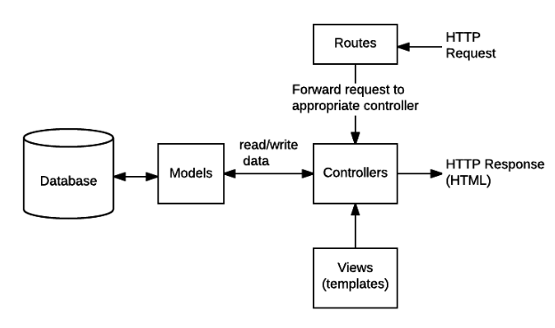

# MongoDB, Express, NodeJS Server

This package demonstrates a Javascript backend framework for web apps, using Express, NodeJS, and MongoDB. This tech stack, combined with a React frontend, is commonly referred to as the MERN tech stack. MongoDB is a NoSQL database, and Express is a Javascript framework capable of serving web apps.

This package is configured to serve a simple API over a local network. The API includes one route, `users`, which controls the interface to the **Users** model in the database. The **Users** data model has two attributes, **name**, and **email**. The data model was chosen for simplicity, to demonstrate two main ways to interact with the MongoDB, `POST` and `GET`.

When the user makes an HTTP request, Express uses the appropriate **Route** to forward the request to a controller. The controller is self-contained within the Express framework. The controller then communicates with the database to either retrieve or store information. `POST` and `GET` requests are routed differently. For more details, inspect the `api/users.js` file.



## Configuration

MongoDB should provide a connection string for the Node.js driver, resembling the following string. To connect to the MongoDB cluster, create a file `.env` and add the appropriate parameters.

```
MONGO_USERNAME=myusername
MONGO_PASSWORD=mypassword
MONGO_ENDPOINT="endpoint.mongodb.net"
MONGO_DATABASE=mydb
```

## Usage

```
npm install
npm start
```

## Credit
- [NPM Documentation](https://docs.npmjs.com/cli/start.html)
- [Express Routes and Controllers](https://developer.mozilla.org/en-US/docs/Learn/Server-side/Express_Nodejs/routes)
- [Deploying a MERN application to Heroku](https://www.freecodecamp.org/news/deploying-a-mern-application-using-mongodb-atlas-to-heroku/)
